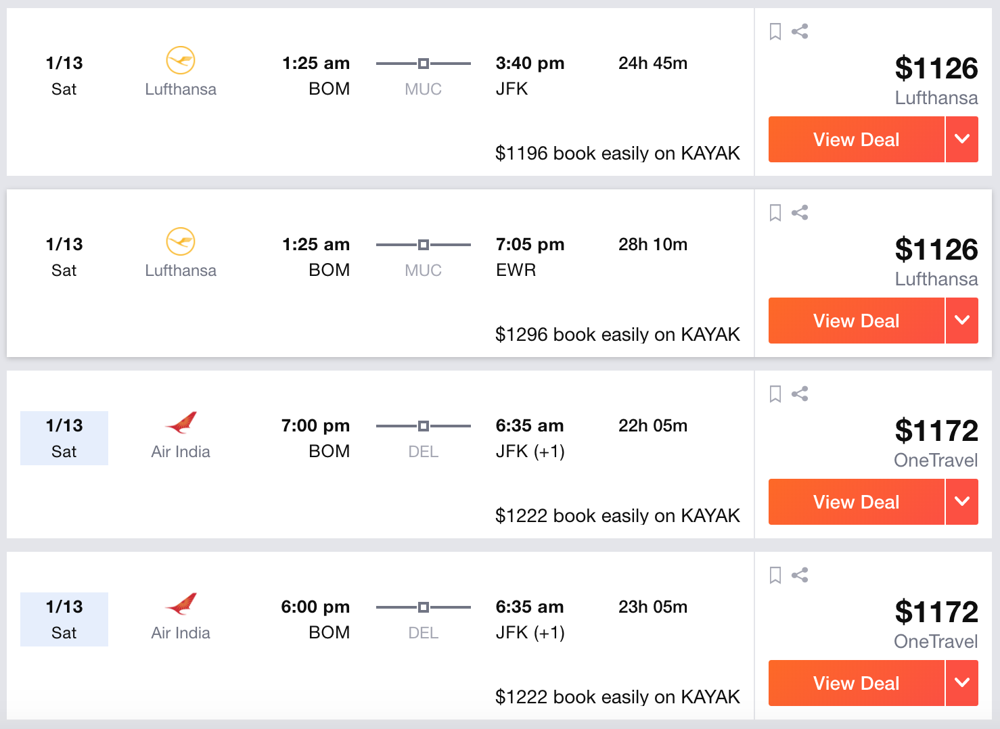

# Cheapest Flight Finder
Assignments created as a Teaching Assistant for Machine Learning course at OSU. 

It uses dynamic programming to find multi-hop flights cheaper than any other on the internet. The only drawback being that you wont be able to book them under same PNR and therefore a delay in earlier flight may lead to missing the next flight

Example:
Cheapest BOM to NYC on flights for a particular date displayed by kayak.com are as follows - 

The cheapest flight calculated by the algorithm for BOM-NYC for the same date is $990 as one-hop BOM-LHR-NYC. You can see the corresponding flights in above images
